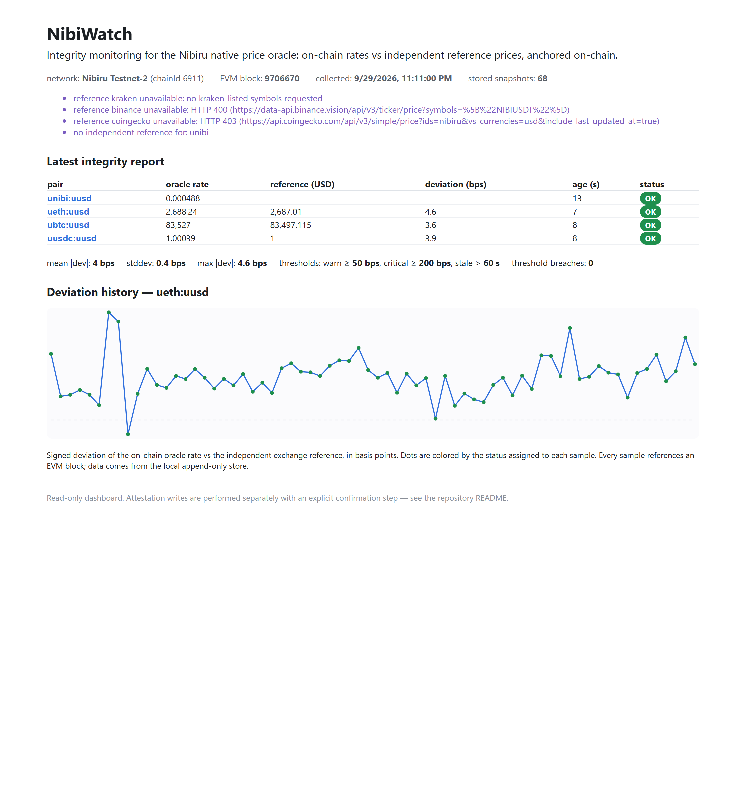
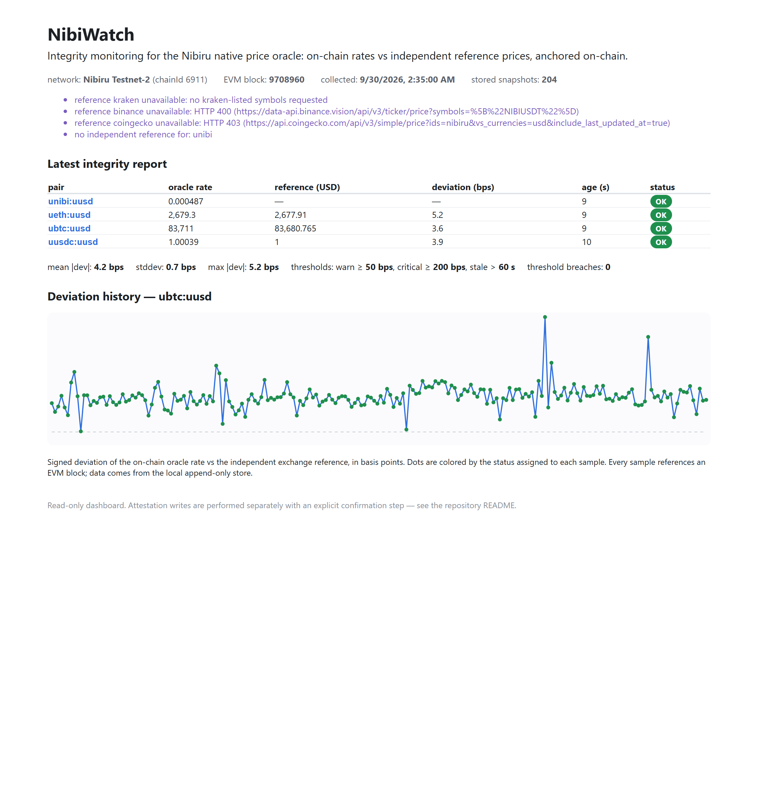

# NibiWatch

Independent integrity monitoring for the [Nibiru](https://nibiru.fi) native
price oracle. NibiWatch reads every configured oracle pair straight from the
chain, compares each on-chain rate against independent public reference
prices, flags deviations and staleness, and optionally anchors the resulting
reports on-chain in a tamper-evident registry contract.

It answers one question for anyone who depends on Nibiru prices — protocol
authors, integrators, auditors, users — before a bad price becomes a bad
liquidation: **is the oracle currently reporting sane, fresh values, and is
there a public record of it?**

## Problem

Nibiru's oracle is chain infrastructure. Validators vote on exchange rates for
pairs such as `ubtc:uusd` and `ueth:uusd`, and every on-chain protocol that
lends, liquidates, or settles reads those rates through the oracle precompile.
A rate that goes stale, or that drifts away from the rest of the market, is a
direct financial hazard to anything that consumes it — and by the time a bad
liquidation is visible, the damage is already done.

Two concrete things motivate this tool, both observed on Nibiru:

1. **There is no independent assurance layer.** The oracle is consumed by
   live protocols, but nothing on the ecosystem side continuously checks the
   reported rates against outside reference prices and publishes the result.
   Consumers have to trust the feed with no external cross-check.

2. **The convenience wrappers are not reliable.** The Chainlink-style
   aggregator contracts deployed alongside the oracle revert on
   `latestRoundData()` on both Testnet-2 and mainnet (verified directly via
   `eth_call`). The robust way to read rates today is the native
   `queryExchangeRate` precompile — which no friendly, auditable monitoring
   surface exposes.

## Solution

NibiWatch is a small, transparent monitoring stack:

- **Reads real oracle data** — calls the native `queryExchangeRate` precompile
  at `0x…0801` over the EVM RPC and decodes the rate, its update timestamp,
  and its update block height. No wrapper, no assumptions.
- **Cross-checks against the outside world** — compares each rate with
  independent reference prices from public exchange endpoints (Coinbase,
  Kraken, and a Binance public data mirror; CoinGecko is supported via an
  optional key). Deviation is expressed in basis points.
- **Applies an explicit status machine** — every sample becomes `ok`,
  `warning`, `critical`, `stale`, or `unavailable` from configurable
  thresholds.
- **Keeps a local, append-only history** — every snapshot is stored as JSON
  lines with full provenance so results can be inspected and reproduced.
- **Anchors reports on-chain (optional)** — writes a compact integrity report
  per pair to an on-chain registry so the record is public and tamper-evident,
  readable by anyone with plain `eth_call`.
- **Shows it in a dashboard** — a read-only web UI renders the latest report,
  deviation history, and summary statistics from the local store.

Everything is configuration-driven: RPC endpoint, chain id, explorer, oracle
pairs, thresholds, and registry address are all overridable per environment,
so the same code runs against Testnet-2 or mainnet.

## How It Works

```
Nibiru EVM RPC (oracle precompile 0x…0801)          public exchange APIs
        |                                                     |
        v                                                     v
  OracleReader.query(pair)                          ReferenceClient.fetch()
        |  decoded rate, update ts, update height         |  USD quote + provenance
        +-----------------------+-------------------------+
                                v
                    analyze(): deviation (bps), age (s),
                    status machine (ok/warning/critical/stale/unavailable)
                                v
                    append-only JSONL store  (data/state.jsonl)
                                |
              +-----------------+------------------+
              v                                     v
     read-only HTTP API (/api/status,           optional attestation:
       /api/history)                              compact report -> registry
              v                                   contract (on-chain, public)
        web dashboard (latest report,
        deviation history, summary stats)
```

A **snapshot** is one pass: read every configured pair, fetch references,
analyze, and append the result. `monitor:once` runs a single pass;
`monitor:loop` runs them on a cadence (default 5 minutes). Attestation is a
separate, explicit step so nothing writes to the chain unless you ask it to.

## Data

All inputs are real and public; nothing is generated or simulated.

| Data | Source | Retrieval | Notes |
|------|--------|-----------|-------|
| On-chain oracle rate, update timestamp, update block height | Nibiru native oracle precompile `0x…0801`, `queryExchangeRate(pair)` | `eth_call` to the EVM RPC at `latest` | rate in 18 fixed-point decimals; works on Testnet-2 (6911) and mainnet (6900) |
| Independent reference price (USD) | Coinbase spot, Kraken ticker, Binance public data mirror (`data-api.binance.vision`) | keyless HTTPS GET, tried in order per symbol | first provider to answer a symbol wins; provenance (provider, retrieval time, upstream trade time) stored with each quote |
| Optional reference fallback | CoinGecko `/simple/price` | HTTPS GET, optional demo API key | raise rate limits by supplying `COINGECKO_API_KEY` |

Reference handling details that affect interpretation:

- **Binance quotes are USDT-quoted**, not USD; the quote stablecoin is itself
  oracle-priced, so Binance is ordered last and flagged in quote metadata.
- **`unibi:uusd` has no keyless public reference** in the default set (no free
  exchange endpoint quotes NIBI), so NIBI is reported on **freshness only**
  unless you add a NIBI-capable reference. This is surfaced in the UI and in
  the run notes rather than hidden.
- Reference prices and the oracle use independent clocks; the deviation metric
  compares the oracle's last value against a spot quote fetched at read time,
  so normal short-term market movement shows up as small basis-point noise.

See [docs/data.md](docs/data.md) for exact endpoints, schemas, and the
methodology for deviations, staleness, and status assignment.

## Product Demo

The dashboard is read-only and renders from the local append-only store.



The latest report lists, per pair, the on-chain oracle rate, the independent
reference price, the deviation in basis points, the value age, and the status.
Clicking a pair renders its deviation history.



In the demonstration run below (204 snapshots across 7h12m on Testnet-2,
2026-09-29 16:22Z to 23:35Z; 816 pair-samples, 614 of them priced against an
independent reference), every pair stayed well inside the 50 bps warning
threshold:

| pair | priced samples | mean deviation | worst deviation | status |
|------|----------------|----------------|-----------------|--------|
| `ueth:uusd` | 203 | +4.06 bps | 15.7 bps | ok |
| `ubtc:uusd` | 204 | +3.98 bps | 12.9 bps | ok |
| `uusdc:uusd` | 204 | +3.74 bps | 4.6 bps | ok |
| `unibi:uusd` | 3 | +12.11 bps | 20.1 bps | ok |

`unibi:uusd` shows 3 rather than 204 because no free reference endpoint
listings for NIBI answered during this window; the monitor recorded the
pair's freshness and said so explicitly instead of inventing a comparison.
Zero threshold breaches and zero stale samples across the whole window. The
complete dataset is committed at `data/samples/example-snapshots.jsonl`;
`node scripts/stats.cjs` recomputes every number in this table from it.

## Example Transactions

The registry contract and integrity reports live on Nibiru Testnet-2
(chain id 6911). These are real transactions from the demonstration wallet;
anyone can verify them on the explorer and read the same record back with
plain `eth_call` (see `scripts/verify.ts`).

| item | value |
|------|-------|
| Registry address | `0x1E35A33E51885b9b87a9a25CaB6F28797701669F` |
| Deployment tx | `0xd6e1e9c914b70ea94f0584b915afba4f8e47522497747cffabfdc06721547961` |

Anchored integrity reports (one confirmed transaction per pair):

| pair | transaction |
|------|-------------|
| `unibi:uusd` | `0x266ad485303983aef8b8be6770666c312ada9fcb131fab394a66cafa0fc15749` |
| `ueth:uusd` | `0xf5408f621a5340797fa354ec0d8bfcd2b86a717f2bdd2ed5ed1c7c825e1e8563` |
| `ubtc:uusd` | `0xd4d353f969d73e9e069379833a1333e70ff5745d83ccfed6382d14e303e5a54c` |
| `uusdc:uusd` | `0xfe502ba10c638791bd727fdbe33f870e2fb64c67063dbce4c8e3dade44e04b81` |

Explorer links (append to `https://testnet.nibiscan.io/`):

- address: `address/0x1E35A33E51885b9b87a9a25CaB6F28797701669F`
- deployment: `tx/0xd6e1e9c914b70ea94f0584b915afba4f8e47522497747cffabfdc06721547961`

The demonstration uses a dedicated low-value testnet account. You do not need
it: configure your own wallet and network and reproduce the same workflow
(see [docs/reproducibility.md](docs/reproducibility.md)).

## Installation

Prerequisites: **Node.js >= 20** and Git. No local node or global packages
required — the project talks to the public Nibiru RPC.

```bash
git clone https://github.com/Pillar-5/nibiru-labs.git
cd nibiru-labs
npm install
cp .env.example .env       # then edit as described below
```

Verify the install by reading live oracle data (read-only, no wallet needed):

```bash
npm run oracle:read
```

Expected output: one line per configured pair with the decoded on-chain rate
and its age, for example `ueth:uusd rate=2681.16 … age_s=7`. If this prints,
the oracle integration works on your machine.

## Configuration

NibiWatch is configured through environment variables (see `.env.example`).
Copy it to `.env`; `.env` is git-ignored and must never be committed.

| variable | default | meaning |
|----------|---------|---------|
| `NETWORK` | `testnet-2` | selects the built-in preset (`testnet-2` or `mainnet`) |
| `NIBIRU_RPC_URL` | preset | EVM RPC endpoint override |
| `NIBIRU_CHAIN_ID` | preset | chain id override (6911 testnet, 6900 mainnet) |
| `EXPLORER_BASE_URL` | preset | explorer base used in printed links |
| `ORACLE_PRECOMPILE` | `0x…0801` | oracle precompile address |
| `ORACLE_PAIRS` | `unibi:uusd,ueth:uusd,ubtc:uusd,uusdc:uusd` | comma-separated pairs to monitor |
| `SYMBOL_MAP` | `unibi=NIBI,ueth=ETH,ubtc=BTC,uusdc=USDC` | base denom -> reference symbol |
| `REFERENCE_PROVIDERS` | `coinbase,kraken,binance,coingecko` | provider order, first answer wins |
| `COINGECKO_API_KEY` | (empty) | optional demo key to raise CoinGecko limits |
| `DEVIATION_WARN_BPS` | `50` | absolute deviation that raises `warning` |
| `DEVIATION_CRITICAL_BPS` | `200` | absolute deviation that raises `critical` |
| `MAX_ORACLE_AGE_SECONDS` | `60` | oracle value age beyond which status is `stale` |
| `MONITOR_INTERVAL_MS` | `300000` | cadence for `monitor:loop` |
| `ATTESTATION_REGISTRY` | (from `data/deployment.json`) | registry address to write/read |
| `NIBIRU_PRIVATE_KEY` | (unset) | local signing key for deploy/attest only; **never** committed |

Network endpoints are presets, not hardcoded constants: set `NIBIRU_RPC_URL`,
`NIBIRU_CHAIN_ID`, and `EXPLORER_BASE_URL` to target any EVM-compatible Nibiru
deployment. The monitor itself is network-agnostic.

## Usage

```bash
# One monitoring pass: read oracle + references, analyze, append to store
npm run monitor:once

# Continuous monitoring at the configured cadence
npm run monitor:loop

# Compile the registry contract (solc 0.8.26, shanghai EVM target)
npm run contract:compile

# Deploy the registry with your own wallet
#   .env: NIBIRU_PRIVATE_KEY=<your low-value testnet key>
npm run contract:deploy

# Anchor the latest snapshot, one report per pair.
# Presents a dry-run summary and requires explicit confirmation
# (interactive, or ATTEST_AUTO_CONFIRM=1 for automation).
npm run attest:submit

# Read the anchored record back from the chain and print it (read-only)
npm run contract:verify

# Start the read-only API, then the dashboard in another terminal
npm run api          # http://127.0.0.1:8787
npm run web:dev      # http://localhost:5173 (proxies /api to the API)
```

The signing path is deliberately split into **read**, **prepare**, **sign**,
and **broadcast** stages. `attest:submit` prepares and shows the exact call
and projected gas cost, then requires confirmation before signing; it also
skips a pair whose identical content hash is already on-chain, so re-running
it is safe and never duplicates an anchored record.

## Reproducing the Analysis

The pipeline is deterministic given its inputs, and its inputs are public.

1. **Read oracle data**: `npm run oracle:read` calls the precompile and prints
   decoded rates. This needs no wallet and no store.
2. **Collect snapshots**: `npm run monitor:once` appends a snapshot to
   `data/state.jsonl` with full provenance (oracle block, reference provider,
   timestamps). Running `npm test` exercises the analysis on fixed inputs so
   the numbers are reproducible without any network.
3. **Inspect a snapshot**: each line in `data/state.jsonl` is a JSON object
   with per-pair `oracleRate`, `referenceUsd`, `deviationBps`,
   `oracleAgeSeconds`, `status`, and the provenance fields, plus a `summary`.
   Deviation is `(oracleRate/referenceInPairUnits - 1) * 10_000` in bps;
   the reference USD is converted into the pair's quote terms first.
4. **Reproduce on-chain anchoring**: `npm run contract:deploy` then
   `npm run attest:submit` against your own funded testnet account produce
   the same kind of transactions listed above, verifiable on the explorer.

Methodology, including the reference-to-pair-unit conversion and the status
precedence (price breach outranks staleness), is documented in
[docs/data.md](docs/data.md).

## Architecture

| component | location | role |
|-----------|----------|------|
| Oracle reader | `src/oracle/precompile.ts` | `eth_call` to `queryExchangeRate`, ABI decode, age computation |
| Reference clients | `src/oracle/reference.ts` | Coinbase/Kraken/Binance/CoinGecko providers, ordered fallback, provenance |
| Integrity analysis | `src/analysis/integrity.ts` | deviation (bps), staleness, status machine, summary statistics |
| Store | `src/store.ts` | append-only JSONL snapshots, history reads |
| Monitor | `src/monitor.ts` | one pass: read -> reference -> analyze -> append |
| Attestation | `src/attestation.ts`, `src/cli/submit-attestation.ts` | build report, dedupe by content hash, guarded sign & broadcast |
| Registry contract | `contracts/OracleAttestationRegistry.sol` | on-chain latest-report-per-pair, counts, events, duplicate rejection |
| API | `src/server/api.ts` | read-only `/api/status`, `/api/history` |
| Dashboard | `web/` (Vite + React) | renders latest report, deviation history, summary |
| CLIs | `src/cli/*` | `oracle:read`, `monitor:once`, `monitor:loop`, `attest:submit` |
| Scripts | `scripts/*` | compile (solc), deploy, verify, screenshot |

The on-chain component stores integrity reports; the analysis stays off-chain
where the reference data and statistics live. That split is intentional — see
[Nibiru Integration](#nibiru-integration).

## Testing

```bash
npm test               # deterministic suite (no network required)
LIVE_TESTS=1 npm test  # additionally reads the live oracle on both networks
npm run typecheck      # tsc --noEmit
npm run web:build      # production build of the dashboard
```

34 tests across 4 files. The default suite runs offline and covers the
analysis (deviation, staleness, status precedence), reference provider
fallback, store round-trips, and attestation content hashing. With
`LIVE_TESTS=1`, four additional tests read the oracle precompile on both
Testnet-2 and mainnet and assert the decoded tuple layout. All tests pass.
Contract-level behavior is covered by the live attestation/verify path
against Testnet-2 and by the on-chain duplicate-rejection check.

## Nibiru Integration

Nibiru is used for two distinct things, each doing work the other cannot:

- **Reading the oracle (off-chain analysis input).** The native oracle is
  exposed to EVM as a precompile: `queryExchangeRate(string pair)` at
  `0x000000000000000000000000000000000000000000000801` returns
  `(uint256 exchangeRate, uint64 updateBlockTimestampMs, uint64 updateBlockHeight)`
  with the rate in 18 fixed-point decimals. It behaves identically on
  Testnet-2 (6911) and mainnet (6900), which is why the monitor is
  network-agnostic. NibiWatch reads through this path rather than the
  Chainlink-style wrappers, which revert on `latestRoundData()` on both
  networks.

- **Anchoring reports (on-chain record).**
  [`OracleAttestationRegistry.sol`](contracts/OracleAttestationRegistry.sol)
  is a purpose-built contract for storing integrity reports on-chain: the
  latest report per pair, per-pair report counts, duplicate-content rejection,
  and events carrying every field. It holds no funds and runs no asset logic.
  It is compiled for the `shanghai` EVM target because Testnet-2 rejects
  Cancun opcodes (see [docs/deployment.md](docs/deployment.md)).

Why this on-chain part earns its place: an integrity feed is only useful as a
*public attestation*. Anchored on the same chain as the oracle, the record is
readable by any Nibiru consumer through the same `eth_call` path the oracle
uses, and it cannot be quietly edited or deleted by the monitoring operator.
The deviation math and reference fetching stay off-chain, where the external
data and statistics belong, and that boundary is drawn explicitly rather than
to make the project look like on-chain infrastructure.

## Development

- Stack: TypeScript, Node >= 20, ethers v6, Vite + React, an Express API, and
  `solc` 0.8.26 pinned through `scripts/compile.ts`. No Hardhat/Foundry
  dependency; the public RPC is sufficient for the first phase.
- Add a pair: extend `ORACLE_PAIRS` and `SYMBOL_MAP` in `.env`; no code change.
- Add a reference source: implement the `ReferenceProvider` interface in
  `src/oracle/reference.ts` and list it in `REFERENCE_PROVIDERS`.
- Extend the dashboard against the read-only API contract; it is the same
  shape the store produces, so a longer-history backend can replace it without
  touching the UI.
- Contribution flow: branch, keep `npm run typecheck`, `npm test`, and
  `npm run web:build` green, and never commit `.env` or any key. The pre-push
  checklist lives in [docs/reproducibility.md](docs/reproducibility.md).

## Roadmap

Steps that follow directly from the working core:

1. **Alerting** — webhook/Telegram notification on `warning`/`critical`/
   `stale` transitions, driven by the same status machine.
2. **Pair auto-discovery** — pull the active-pair set from the oracle module
   instead of static config as Nibiru exposes it.
3. **Attestation daemon** — periodic anchoring with rolling per-window
   statistics so the on-chain record accumulates continuously.
4. **Historical API and public status page** — serve long-range history behind
   the same read-only contract the current API uses.
5. **Consumer SDK** — thin TypeScript and Solidity helpers so Nibiru protocols
   can check the anchored record from inside their own contracts.
6. **Mainnet deployment** — network selection is already configuration;
   mainnet runs remain untested until actually performed.

## License

MIT — see [LICENSE](LICENSE).
